# fromDataset Operator Architecture

## Overview

The `fromDataset` operator represents a paradigm shift in how Nextflow workflows access external data sources. Instead of fragmented, direct integrations with varying quality, it provides a unified Platform-mediated experience.

---

## Problem: Current Fragmented Approach

```mermaid
graph TD
    subgraph "Disjointed Plugin Architecture"
        NF[Nextflow Workflow]

        NF -->|Plugin A| Benchling[Benchling]
        NF -->|Plugin B| GeneBank[GeneBank]
        NF -->|Plugin C| ENA[ENA Database]
        NF -->|Plugin D| Custom[Custom DB]

        Benchling -.->|Direct API<br/>Quality: ?| NF
        GeneBank -.->|Different Auth<br/>Quality: ?| NF
        ENA -.->|Different Format<br/>Quality: ?| NF
        Custom -.->|Custom Protocol<br/>Quality: ?| NF
    end

    style Benchling fill:#ff6b6b
    style GeneBank fill:#ff6b6b
    style ENA fill:#ff6b6b
    style Custom fill:#ff6b6b

    Problems["❌ Problems:<br/>• Inconsistent APIs<br/>• Varying plugin quality<br/>• No centralized auth<br/>• Platform cut out<br/>• Hard to maintain"]

    style Problems fill:#ffe66d,stroke:#333,stroke-width:2px
```



**Issues with the current approach:**
- Multiple authentication mechanisms
- Inconsistent data formats
- Plugin quality varies significantly
- Platform has no visibility or control
- Users must learn different APIs for each source
- Difficult to audit and secure

---

## Solution: Platform-Mediated Unified Access

```mermaid
graph TB
    subgraph "User Layer"
        User[Workflow Developer]
        NF[Nextflow Workflow]
    end

    subgraph "Platform Layer - Seqera Platform"
        Platform[Seqera Platform<br/>🎯 Unified API]
        Auth[Authentication & Authorization]
        Cache[Dataset Cache]
        Metadata[Dataset Metadata Service]
        Audit[Audit & Logging]
    end

    subgraph "Data Source Layer"
        Benchling[Benchling]
        GeneBank[GeneBank]
        ENA[ENA Database]
        Custom[Custom Sources]
        Cloud[Cloud Storage<br/>S3/GCS/Azure]
    end

    User -->|Write| NF
    NF -->|"Channel.fromDataset('benchling-ds-123')"| Platform

    Platform <--> Auth
    Platform <--> Cache
    Platform <--> Metadata
    Platform <--> Audit

    Platform -->|Managed Connection| Benchling
    Platform -->|Managed Connection| GeneBank
    Platform -->|Managed Connection| ENA
    Platform -->|Managed Connection| Custom
    Platform -->|Managed Connection| Cloud

    Benchling -.->|Standardized Response| Platform
    GeneBank -.->|Standardized Response| Platform
    ENA -.->|Standardized Response| Platform
    Custom -.->|Standardized Response| Platform
    Cloud -.->|Standardized Response| Platform

    Platform -.->|"Unified Dataset Channel"| NF

    style Platform fill:#51cf66,stroke:#2f9e44,stroke-width:3px
    style Auth fill:#a5d8ff
    style Cache fill:#a5d8ff
    style Metadata fill:#a5d8ff
    style Audit fill:#a5d8ff
    style NF fill:#748ffc

    Benefits["✅ Benefits:<br/>• Single API interface<br/>• Centralized authentication<br/>• Consistent data format<br/>• Platform visibility<br/>• Caching & optimization<br/>• Audit trail<br/>• Quality guaranteed"]

    style Benefits fill:#b2f2bb,stroke:#2f9e44,stroke-width:2px
```



**Advantages of Platform-mediated access:**
- **Unified Experience**: One API (`fromDataset`) for all data sources
- **Platform Control**: Seqera Platform manages access, authentication, and permissions
- **Quality Assurance**: Standardized, tested integrations
- **Security**: Centralized audit trail and access control
- **Performance**: Built-in caching and optimization
- **Scalability**: Platform handles connection pooling and rate limiting

---

## Detailed Data Flow: fromDataset Operator


**Step-by-step flow:**

1. **User writes workflow** with `Channel.fromDataset('benchling-samples-2024')`
2. **Nextflow initializes** the fromDataset operator
3. **DatasetExplorer** validates query parameters
4. **Platform authentication** using `TOWER_ACCESS_TOKEN`
5. **Platform API** verifies permissions and authorization
6. **Platform queries Benchling** using managed credentials (user doesn't need Benchling API key!)
7. **Benchling returns** sample/dataset records
8. **Platform standardizes** the response format
9. **Platform caches** dataset for future use
10. **Audit logging** records the access
11. **Dataset metadata** returned to Nextflow
12. **Channel emits** dataset records to workflow
13. **Workflow processes** the data

---

## Benchling Use Case: Concrete Example

```mermaid
graph LR
    subgraph "Workflow Script"
        Code["<b>main.nf</b><br/>───────────<br/>Channel.fromDataset(<br/>  'benchling-samples'<br/>)<br/>.map { sample -><br/>  [sample.id,<br/>   sample.fastq_r1,<br/>   sample.fastq_r2]<br/>}<br/>.set { samples_ch }"]
    end

    subgraph "Platform Configuration"
        Config["<b>Platform Dataset Config</b><br/>─────────────────────<br/>Name: benchling-samples<br/>Type: Benchling Registry<br/>Endpoint: benchling.com<br/>Auth: OAuth (managed)<br/>Filters: status=ready<br/>Refresh: hourly"]
    end

    subgraph "Benchling"
        Registry["<b>Benchling Registry</b><br/>───────────────<br/>Sample-001<br/> • R1: s3://...<br/> • R2: s3://...<br/>Sample-002<br/> • R1: s3://...<br/> • R2: s3://..."]
    end

    subgraph "Nextflow Channel"
        Ch["<b>Channel Output</b><br/>────────────<br/>[sample-001,<br/> /path/r1.fq,<br/> /path/r2.fq]<br/>───────────<br/>[sample-002,<br/> /path/r1.fq,<br/> /path/r2.fq]"]
    end

    Code -->|"fromDataset API"| Config
    Config -->|"Platform queries<br/>(managed auth)"| Registry
    Registry -->|"Standardized<br/>format"| Ch
    Ch -->|"Standard Nextflow<br/>channel operations"| Workflow[Downstream Processes]

    style Config fill:#51cf66,stroke:#2f9e44,stroke-width:2px
    style Code fill:#748ffc
    style Ch fill:#ffd43b
    style Registry fill:#ff8787
```



**Key advantages for Benchling integration:**
- **No direct Benchling API key** required in workflow
- **Platform manages OAuth** and credential refresh
- **Automatic filtering** and querying
- **Standardized output** format across all data sources
- **Cache** Benchling responses to avoid rate limits
- **Audit trail** of what samples were accessed

---

## Phase 1: Foundation (Current Implementation)


---

## Technical Architecture Components


---

## Example Usage in Workflow

```groovy
// nextflow.config
tower {
    enabled = true
    accessToken = env.TOWER_ACCESS_TOKEN
    endpoint = 'https://api.cloud.seqera.io'
}

dataset {
    cache = true
    maxRetries = 3
}
```

```groovy
// main.nf
#!/usr/bin/env nextflow

// Query Benchling samples through Platform
Channel
    .fromDataset('benchling-ready-samples')
    .map { sample ->
        tuple(
            sample.id,
            sample.metadata.species,
            file(sample.fastq_r1),
            file(sample.fastq_r2)
        )
    }
    .set { samples_ch }

// Use in standard Nextflow process
process align {
    input:
    tuple val(sample_id), val(species), path(r1), path(r2)

    output:
    tuple val(sample_id), path("${sample_id}.bam")

    script:
    """
    bwa mem -t ${task.cpus} ${species}.fasta ${r1} ${r2} > ${sample_id}.bam
    """
}

workflow {
    align(samples_ch)
}
```

---

## Success Metrics

### User Experience
- ✅ Single, consistent API for all data sources
- ✅ No need to manage external API credentials
- ✅ Automatic caching and optimization
- ✅ Clear error messages and debugging

### Platform Value
- ✅ Visibility into data access patterns
- ✅ Centralized security and compliance
- ✅ Audit trail for all dataset operations
- ✅ Foundation for advanced features (versioning, lineage)

### Developer Benefits
- ✅ Reduced integration complexity
- ✅ Standardized testing patterns
- ✅ Better documentation
- ✅ Community-driven connector ecosystem

---

## Conclusion

The `fromDataset` operator represents **Phase 1** of transforming data access in Nextflow:

1. **Unified Experience**: One API instead of fragmented plugins
2. **Platform-Mediated**: Seqera Platform as the trusted intermediary
3. **Quality & Security**: Centralized authentication, caching, and audit
4. **Future-Proof**: Foundation for dataset versioning, composition, and advanced features

This architecture positions Seqera Platform as the **essential data layer** for Nextflow workflows, rather than being bypassed by direct integrations of varying quality.
